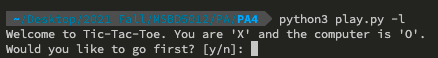
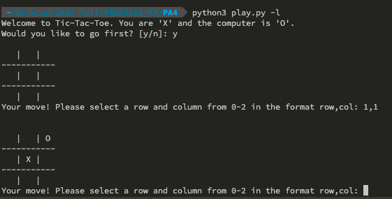
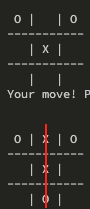
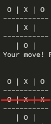
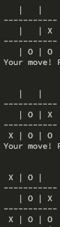

# MSBD 5012 HA5 Tic-Tac-Toe Q-Learning (2021 Fall)

### Name: Yuen Zhikun Stuendt ID: 20505288 ITSC: zyuen

***Command to train the agents in 500,000 episodes and test it with 100,000 episodes after training***
```
python3 play.py -n 500000 -d 0
```

-d 0 turns off the debug mode so the board will not be printed out during training. -d 1 will print out the board for each step.

***Command to load the best agent 'q_agent.pkl' and play the Tic Tac Toe with it***
``` 
python3 play.py -l
```

**Don't try** ```python3 play.py``` **without -l, this will retrain the agent with 0 episode and override the best agent.**

You will be asked to choose go first or not. Enter y to move first and n to let agent move first.


Q agent uses 'O' and the human player uses 'X'. 
Using i,j to represent which grid you want to choose. E.g. 


The saved best agent has the following hyper-parameters:
> alpha = 0.3, gamma = 0.5, epslion = 0.2, eps_decay=0, encourage_explore=True, num_episodes=1,000,000

During learning, the reward policy is
> Win: +1, Lose: -1, Draw: +0.5

Once training is finished, the whole class of the agent won the most will be saved as 'q_agent.pkl' by pickle package. Then, a test function will be processed. During test, the epsilon of the best agent, agent1, will be set as 0 which mean no any random action during testing if there are only one maximum Q-value for the current state. The epsilon of another agent will be set to 1 which means the second agent will only make random action during the whole testing process. Then, the two agents will play the game 100000 episodes in testing.

### The following are some picts to show that the best agent has 'intellgence':

If I want to form occupy three grids in a vertical line, the agent will block me.



Then, the agent blocks me to form a horizontal line.




The agent checks me. I block its diagonal line but it still defeats me.



From the observation during playing with the agent, the agent will block your possible ways to win and will not make a mistake. Even though I pick the middle grid at the first step and do not make any mistakes, I still cannot beat the agent. Form human's point of view, we should pick the middle grid as soos as we can. However, from the agent point of view, it will not do this even it goes first.

### Q-learning
For the agent to learn from the game, I create two same agents and let them to play the game together. There is a little trick for the whole Q-learning set up.

For convinence, I will call the first agent as agent A and second agent as agent  B.

To update the Q-value of agent A, we should update it after agent B make an action instead of updating agent A's Q value immediately after it make an action. Using this way to update the Q-value can let the agents to learn how its action/decision affect the other and receive the feedback from another agent.

Actually, I try both updating policies. The frist one is to update the agent's Q-value immediately after it moves. The second one is to no update the agent's Q-value immediately but updating it after another agent moves.

The experience tuple of the first policy is *(s<sub>A</sub>, a<sub>A</sub>, s'<sub>A</sub>, r<sub>A</sub>, s<sub>B</sub>, a<sub>B</sub>, s'<sub>B</sub>, r<sub>B</sub>, s<sub>A</sub> ... )*. 

The test result in 100,000 episodes after training in 1,000,000 episodes is 
> Agent 1 won 85352, Agent 2 won 3375, Num draw: 11273

The experience tuple of the second policy is *( ... s<sub>A</sub>, a<sub>A</sub>, s'<sub>B</sub>, r<sub>B</sub>, s<sub>B</sub>, a<sub>B</sub>, s'<sub>A</sub>, r<sub>A</sub>, s<sub>A</sub>, a<sub>A</sub>, s'<sub>B</sub>, r<sub>B</sub> ... )*

The test result in 100,000 episodes after training in 1,000,000 episodes is
> Agent 1 won 94640, Agent 2 won 0, Num draw: 5360

From the test result above, the agent using update policy 2 is unbeatable by a random agent after 1,000,000 episodes in training. However, the agent using update policy 1 is still possible to be defeated by a random agent.

I believe that this is because agent with the first update policy only know how it can obtain the maximum rewards according to its own action only. It does not know how its action will affect another agent's decision and cannot get feedback from another agent. It cannot predict how the other agent will move. In the second update policy, the agent will receive a feedback from another agent's move after it make a decision. It knows how to maximum the rewards according to its own decision and the othe agent's feedback. Thus, it become more robust.

The reward of winning is 1, failure is -1 and draw is 0.5. I also try to change the reward of draw to 0, but the result is wrose after 1,000,000 training episodes.
> Agent 1 won 91504, Agent 2 won 1034, Num draw: 7462

***Some interesting techniques for training two agents with Q-learning***

Since the Q-learning always depends on the maximum Q-value to make a decision.

1. **Encourage Exploration**: If the Q-value of the action-state is None i.e. this action-state hasn't been explored before, a Q-value 1 will be assigned to this action-state so that the agent will explore this unseen case. Encouraging the agent to explore more can let the agent learn faster just like we should explore more some unknown field in reality.

2. **Esplion Decay**: Duing training, there is an esplion parameter for the agent to have some probability to make some random decision/action. This makes its competitor harder to guess its next action. If the esplion is too high, the agent will always make random action and will not follow the best action-state value in Q-table. However, high esplion is not a bad idea. It encourages the agent to explore more action-state, i.e. the goal is similar to the first approaches. Thus, we can initialize a high esplion for the agent at the begining to encourage it explore more and decay the esplion value during training to let it follow the Q-table after enough exploration.

### Test results table:

After training N episodes, we will test the best agent (agent 1, update policy 2) with a random-action agent (agent 2) for 100,000 episodes.

| Training episodes | Baseline | Encourage Exploration | Esplion Decay | Both |
| ----------- | ----------- | ----------- | ----------- | ----------- |
| 10,000      | Agent 1 won 73236 <br> Agent 2 won 3906 <br> Num draw: 22858       |Agent 1 won 90118 <br> Agent 2 won 379 <br> Num draw: 9503       |Agent 1 won 29602 <br> Agent won 26368 <br> Num draw: 44030       |Agent 1 won 81749 <br> Agent 2 won 3114 <br> Num draw: 15137       |
| 50,000   	| Agent 1 won 80084 <br> Agent 2 won 2919 <br> Num draw: 16997        |Agent 1 won 93747 <br> Agent 2 won 0 <br> Num draw: 6253       |Agent 1 won 81861 <br> Agent 2 won 3919 <br> Num draw: 14220       |Agent 1 won 94419 <br> Agent 2 won 0 <br> Num draw: 5581       |
| 100,000   	| Agent 1 won 78993 <br> Agent 2 won 4891 <br> Num draw: 16116        |Agent 1 won 94580 <br> Agent 2 won 0 <br> Num draw: 5420      |Agent 1 won 92236 <br> Agent 2 won 0 <br> Num draw: 7764       |Agent 1 won 93709 <br> Agent 2 won 0 <br> Num draw: 6291       |
| 250,000   	| Agent 1 won 94397 <br> Agent 2 won 0 <br> Num draw: 5603        |Agent 1 won 94372 <br> Agent 2 won 0 <br> Num draw: 5628       |-       |-       |
| 500,000   | Agent 1 won 95190 <br> Agent 2 won 0 <br> Num draw: 4810        |Agent 1 won 94994 <br> Agent 2 won 0 <br> Num draw: 5006       |-       |- |


Esplison Decay with esplion=1 initially and esplion*=(1-decay_rate) in each action. The decay rate is 1e-5. The agent with esplion decay will be tested until 100,000 episodes. As the esplion < 0.1 after 100,000, the agent become always follow the Q-table and no new exploration.

In here, we consider the best model is unbeatable by the random-action agent with the least training episodes. **According to the result from the above table, we can conclude that the agent with encouraging exploration becomes almost unbeatable with 10,000 learning episodes only and totally unbeatable after 50,000 learning episodes.** The idea of esplion decay is good but it is hard to tune the initial esplion and the decay rate, it  is even worse than the baseline with 10,000 learning episodes only. However, it still uses less learning episodes (100,000) to become totally unbeatable than the baseline. 

**Thus, agent with encourage exploration is the best and a easier approach to speed up the learning process.**


### References

The game env and some ideas are from:

1. [rfeinman/tictactoe-reinforcement-learning](https://github.com/rfeinman/tictactoe-reinforcement-learning) (The env and idea of esplion decay, but this respo is a agent to learn from the Minimax Algorithm in Game Theory algorithm)
2. [PhiliPdB/Q-learning-tic-tac-toe](https://github.com/PhiliPdB/Q-learning-tic-tac-toe/tree/e4124423e79b2da9c2efa01669694df04d5ce5f4) (Idea of Encouraging Exploration)

